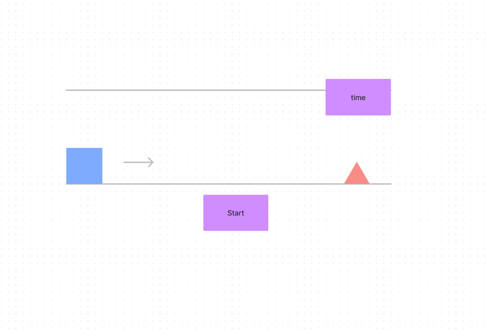

# Box Jumping Game 
#### Simple Browser game
A version of the T-rex game in chrome 

Below is a simple wire frame of how the game should look and some basic mechanics.

as shown about the player will control a Blue Box that jumps over a Red Triangle. The arrow shows how the box will apear to run across the screen  

Above is a quick drawing of the most basic version of the game.
the box appears to move to the left and triangles block your path and you need to jump over them. There is a small number in the top right corner that displays your score. 
 
 ## MVP goals
 1. Create everything that is need for the game in HTML
    - [x] Title and Game space
    - [x] TShe box where both shape will apear
    - [x] Create both Box and Triangle
 2. Add Styling to HTML so that the game is not just black and white.
    - [x] Define font to be use on page
    - [x] Style each element and format the look of each element so that the game looks as close to the Wireframe.
3. Use Javascript to manipulate Dom and create game mechanics 
    - [x] Grab all DOM elements that are need to make the game work
    - [x] Create a function that moves the triangle across the screen and then reset so that it appears that a new one is on the track. 
    - [x] Create a function that allows the player to jump.
    - [x] Create a time / score function that is to be displayed in the top right corner.
    - [x] Create a function that checks for colision of the player Box and the Triangle. 

 If this is completed then more features will be added. (such as)
 game messages (win, lose, current high score ...... and so on )
 reset button on loss of game maybe in a modal?
 add more traingles aat random and maybe objects to duck under?
 sounds

### Bugs and Problems

This section is here to describe issues with the game that either I could not figure out how to implement or fix.
 - The main issue was that the score could not be stopped for some reason with Clearinterval and save to be displayed and used to create a high score board.
 - when adding in the class animations for both triangle and the box the check for the class being there and not being there doesn't seem to work properly.(Spammong the space bar at a fast rate will break the logic.) 

https://paul-ua.github.io/Box-Jumping-game/